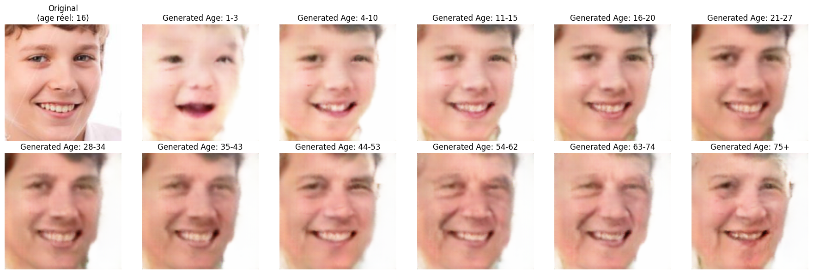
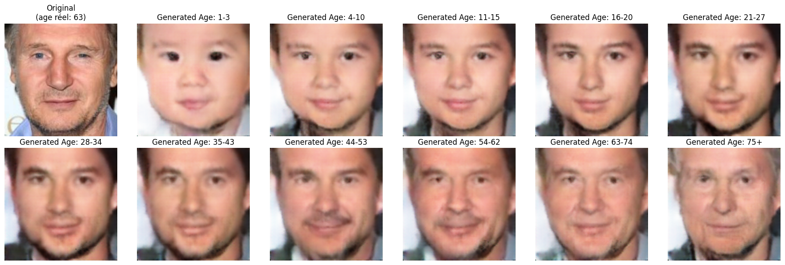
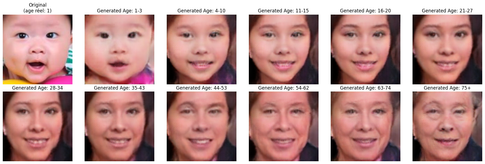
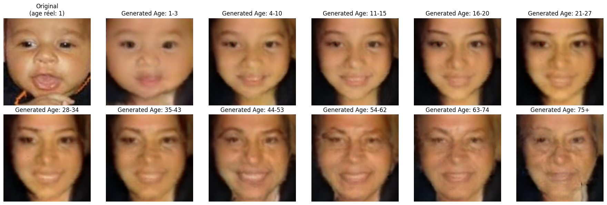
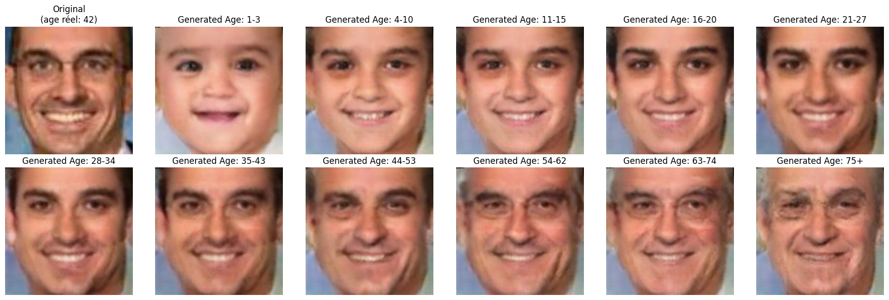
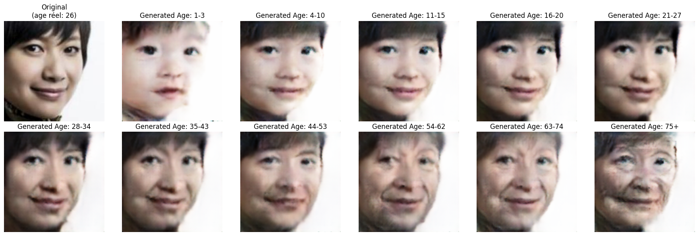
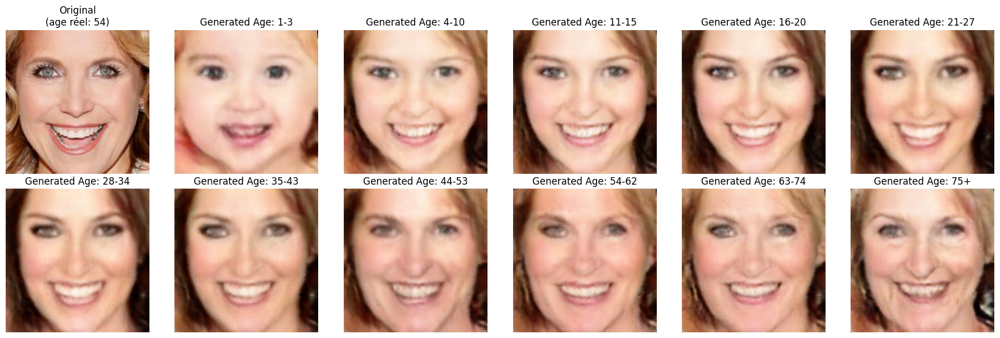
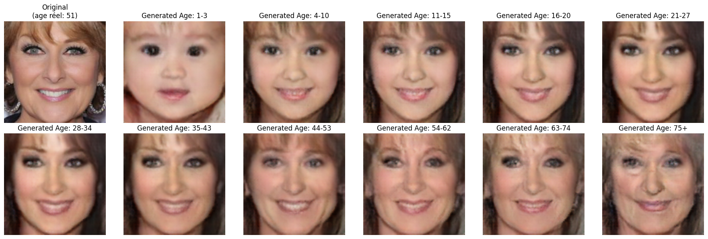
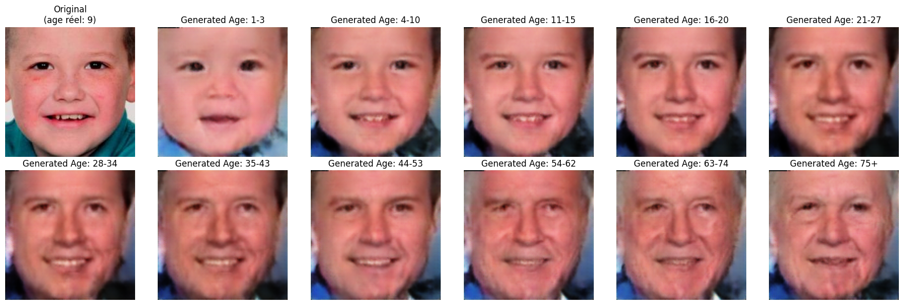

# 🎨 Face Aging with Conditional GAN
A face-aging model capable of performing age progression and age regression while preserving the identity of the person.

## 📌 Project Description
This project implements a conditional GAN designed to generate faces at different ages.
It is trained on the UTKFace dataset, which contains 11 age categories, allowing precise control over the target age for aging or de-aging.
An encoder is also integrated to project a real image into the generator’s latent space, enabling age transformation on real faces without altering their identity.

## 📁 Dataset — UTKFace
More than 20k labeled images
11 age groups
Large diversity in ethnicity, lighting, and conditions

## 🧪 Results

